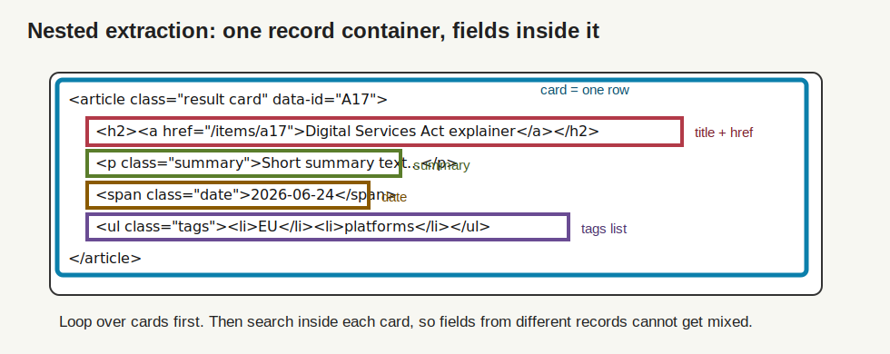
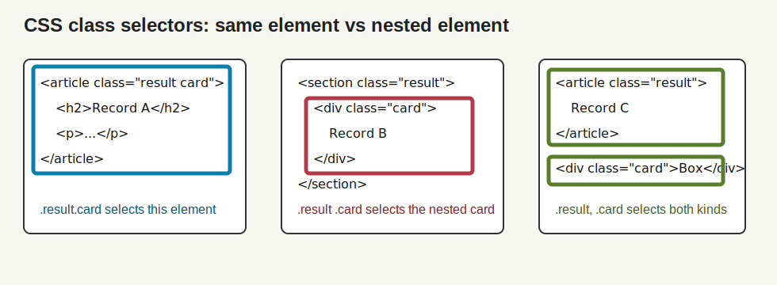
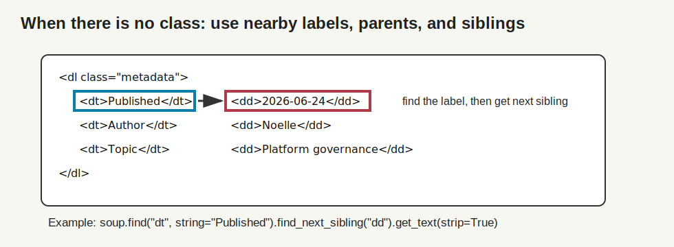

# BeautifulSoup Extraction Patterns

This handout is a companion to the static scraping session. Its goal is not to
memorize every BeautifulSoup method. The goal is to recognize common HTML
structures and choose an extraction pattern that matches the structure.

Official reference: [Beautiful Soup Documentation](https://www.crummy.com/software/BeautifulSoup/bs4/doc/).

## 1. The Basic Mental Model

BeautifulSoup turns HTML text into a tree. A tag can contain text, attributes,
and other tags.

```html
<article class="result card" data-id="A17">
  <h2><a href="/items/a17">Digital Services Act explainer</a></h2>
  <p class="summary">Short summary text...</p>
  <span class="date">2026-06-24</span>
  <ul class="tags">
    <li>EU</li>
    <li>platforms</li>
  </ul>
</article>
```



The methodological move is:

1. Find the repeated record container.
2. Search inside each container.
3. Turn one container into one row.

```python
cards = soup.select("article.result.card")

for card in cards:
    title = card.select_one("h2 a")
    summary = card.select_one(".summary")
    date = card.select_one(".date")
```

This prevents a common error: collecting all titles from the page and all dates
from the page separately, then accidentally pairing the wrong title with the
wrong date.

## 2. `select()` and `select_one()`

Use CSS selectors when you can describe what you want with tag names, classes,
IDs, attributes, or nesting.

```python
soup.select(".quote")
```

Returns a list of all matching elements.

```python
soup.select_one(".quote")
```

Returns the first matching element, or `None` if nothing matches.

Teaching rule:

```text
select()      -> many things, returns a list
select_one()  -> one thing, returns a tag or None
```

## 3. The Most Important Selector Symbols

| Selector | Meaning |
|---|---|
| `h1` | every `<h1>` tag |
| `.quote` | every element with class `quote` |
| `#main` | the element with id `main` |
| `a[href]` | every `<a>` tag that has an `href` attribute |
| `article a` | every `<a>` somewhere inside an `<article>` |
| `article > p` | every `<p>` that is a direct child of `<article>` |
| `.result.card` | elements that have both classes on the same tag |
| `.result .card` | elements with class `card` inside an element with class `result` |
| `.result, .card` | elements matching either `.result` or `.card` |

## 4. Multiple Classes: `.result.card`

This is one of the most confusing CSS selectors.

```html
<article class="result card">
  <h2>Record A</h2>
</article>
```

```python
soup.select(".result.card")
```

means:

```text
Find elements that have class="result" AND class="card" on the same tag.
```

It does **not** mean “find `.card` inside `.result`.”



Compare:

```python
soup.select(".result.card")
```

Same element has both classes.

```python
soup.select(".result .card")
```

There is a space. That means `.card` is nested somewhere inside `.result`.

```python
soup.select(".result, .card")
```

There is a comma. That means select elements that are `.result` OR `.card`.

## 5. Attributes

Attributes are the extra information inside an opening tag.

```html
<a href="/items/a17" class="details-link">Read more</a>
<article data-id="A17" data-source="registry">...</article>
```

Use `.get()` to read an attribute safely:

```python
link = soup.select_one("a.details-link")
href = link.get("href") if link else None
```

Useful attribute selectors:

```python
soup.select("a[href]")
```

All links that have an `href`.

```python
soup.select("a[href^='http']")
```

Links whose `href` starts with `http`.

```python
soup.select("a[href$='.pdf']")
```

Links whose `href` ends with `.pdf`.

```python
soup.select("a[href*='download']")
```

Links whose `href` contains `download`.

```python
soup.select("[data-id]")
```

Any element that has a `data-id` attribute.

```python
soup.select("[data-source='registry']")
```

Elements where `data-source` is exactly `registry`.

## 6. Text

Use:

```python
tag.get_text(" ", strip=True)
```

The first argument, `" "`, joins internal text pieces with spaces. `strip=True`
removes whitespace at the beginning and end.

Example:

```html
<h2>
  Digital
  <span>Services</span>
  Act
</h2>
```

```python
title = soup.select_one("h2")
title.get_text(" ", strip=True)
```

Returns:

```text
Digital Services Act
```

## 7. Repeated Cards

HTML:

```html
<article class="result card" data-id="A17">
  <h2><a href="/items/a17">Digital Services Act explainer</a></h2>
  <p class="summary">Short summary text...</p>
  <span class="date">2026-06-24</span>
</article>

<article class="result card" data-id="B22">
  <h2><a href="/items/b22">Platform transparency report</a></h2>
  <p class="summary">Another short summary...</p>
  <span class="date">2026-06-25</span>
</article>
```

Code:

```python
rows = []

for card in soup.select("article.result.card"):
    title_link = card.select_one("h2 a")
    summary = card.select_one(".summary")
    date = card.select_one(".date")

    row = {
        "record_id": card.get("data-id"),
        "title": title_link.get_text(" ", strip=True) if title_link else None,
        "href": title_link.get("href") if title_link else None,
        "summary": summary.get_text(" ", strip=True) if summary else None,
        "date": date.get_text(" ", strip=True) if date else None,
    }

    rows.append(row)
```

Why this pattern is good:

```text
One repeated card -> one row
Fields inside the card -> columns for that row
Missing field -> None, visible missingness
```

## 8. Nested Lists Inside a Card

HTML:

```html
<article class="result card">
  <h2>Digital Services Act explainer</h2>
  <ul class="tags">
    <li>EU</li>
    <li>platform governance</li>
    <li>regulation</li>
  </ul>
</article>
```

Option A: keep tags as a Python list.

```python
tag_items = card.select(".tags li")
tags = [tag.get_text(" ", strip=True) for tag in tag_items]
```

Returns:

```python
["EU", "platform governance", "regulation"]
```

Option B: store tags in one CSV cell.

```python
tags_for_csv = "|".join(tags)
```

Returns:

```text
EU|platform governance|regulation
```

Option C: one row per tag.

```python
tag_rows = []

for tag in tags:
    tag_rows.append({
        "record_id": record_id,
        "tag": tag,
    })
```

Use this when tags themselves are observations.

## 9. Direct Children vs Any Descendant

HTML:

```html
<article>
  <p>First paragraph.</p>
  <div class="related">
    <p>Related item paragraph.</p>
  </div>
</article>
```

```python
soup.select("article p")
```

Returns both paragraphs, because it means any `<p>` anywhere inside `<article>`.

```python
soup.select("article > p")
```

Returns only:

```html
<p>First paragraph.</p>
```

because `>` means direct child.

This matters when navigation boxes, related items, comments, or footers are
nested inside the main container.

## 10. Labels, Parents, and Siblings

Sometimes there is no useful class. Then use the surrounding structure.

HTML:

```html
<dl class="metadata">
  <dt>Published</dt>
  <dd>2026-06-24</dd>
  <dt>Author</dt>
  <dd>Noelle</dd>
</dl>
```



Code:

```python
published_label = soup.find("dt", string="Published")
published_value = published_label.find_next_sibling("dd")
published = published_value.get_text(strip=True)
```

Returns:

```text
2026-06-24
```

Safer version:

```python
published = None

published_label = soup.find("dt", string="Published")
if published_label:
    published_value = published_label.find_next_sibling("dd")
    if published_value:
        published = published_value.get_text(strip=True)
```

## 11. `find()` and `find_all()`

BeautifulSoup also has its own search methods. These are useful when you want to
search by tag name, attribute dictionary, or exact text.

```python
soup.find("h1")
```

First `<h1>`.

```python
soup.find_all("a")
```

All links.

```python
soup.find_all("a", href=True)
```

All links that have an `href`.

```python
soup.find("article", attrs={"data-id": "A17"})
```

First `<article>` where `data-id="A17"`.

```python
soup.find_all(["h1", "h2", "h3"])
```

All headings of several tag types.

```python
soup.find_all(class_="card")
```

All elements with class `card`. The parameter is `class_` because `class` is a
reserved word in Python.

## 12. Tables

HTML tables can often be handled with pandas:

```python
tables = pd.read_html(html)
first_table = tables[0]
```

But BeautifulSoup is useful when a table needs custom handling.

```python
table_rows = []

for tr in soup.select("table.results tbody tr"):
    cells = [td.get_text(" ", strip=True) for td in tr.select("td")]

    table_rows.append({
        "name": cells[0] if len(cells) > 0 else None,
        "date": cells[1] if len(cells) > 1 else None,
        "status": cells[2] if len(cells) > 2 else None,
    })
```

## 13. Images

HTML:

```html

```

Code:

```python
image_rows = []

for img in soup.select("img[src]"):
    image_rows.append({
        "src": img.get("src"),
        "alt": img.get("alt"),
    })
```

If the `src` is relative, resolve it:

```python
from urllib.parse import urljoin

absolute_src = urljoin(page_url, img.get("src"))
```

## 14. Metadata in `<head>`

Pages often contain metadata that is not visible on the page.

```html
<meta property="og:title" content="Digital Services Act explainer">
<meta name="description" content="A short description of the page.">
```

Code:

```python
og_title = soup.select_one("meta[property='og:title']")
description = soup.select_one("meta[name='description']")

row = {
    "og_title": og_title.get("content") if og_title else None,
    "description": description.get("content") if description else None,
}
```

## 15. A Good Extraction Workflow

Use this order:

1. Open the page in a browser.
2. Inspect one repeated record.
3. Identify the outer container.
4. Test the selector with `len(soup.select(...))`.
5. Extract one record.
6. Add missing-field safeguards.
7. Loop over all records.
8. Save raw HTML and processed CSV.
9. Re-open the CSV and inspect whether rows make sense.

## 16. Selector Debugging Checklist

If a selector returns nothing:

- Did `requests.get()` receive the content, or is it JavaScript-rendered?
- Did you use `.` for class and `#` for id correctly?
- Is there a space where you meant “nested”?
- Did you forget that `.result.card` means both classes on the same element?
- Is the content inside an iframe?
- Is the content loaded after scrolling or clicking?
- Did the site change its HTML?

If a selector returns too much:

- Use a more specific container.
- Prefer `card.select_one(...)` inside a loop over cards.
- Use `>` for direct children.
- Filter by attributes.
- Inspect the first few returned elements with `.prettify()`.

```python
matches = soup.select(".result")
print(len(matches))
print(matches[0].prettify())
```
